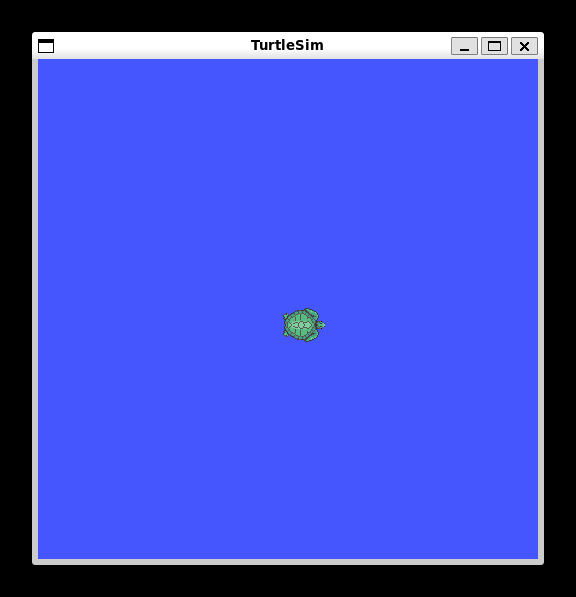

# 4. My First Simulation: TurtleSim

This chapter introduces practical ROS2 development through the **TurtleSim** simulation environment. TurtleSim is a lightweight 2D simulator designed for learning ROS2 fundamentals, including node communication, topic publishing, and service calls. Follow each step sequentially to build hands-on experience with ROS2 tools and concepts.

---

## 4.1 Introduction to TurtleSim

**TurtleSim** is an educational tool that provides a simple 2D environment where a virtual turtle can be controlled through ROS2 commands. It was originally developed for the ROS Tutorials and remains the standard entry point for understanding ROS2 communication patterns.

### 4.1.1 What You Will Learn

By completing this chapter step-by-step, you will:

1. Verify and install TurtleSim packages on your system
2. Launch multiple ROS2 nodes concurrently
3. Control the turtle using keyboard and manual commands
4. Visualize system behavior using RQT tools
5. Understand topics, services, and message structures
6. Complete guided exercises to reinforce learning

### 4.1.2 TurtleSim Components

The TurtleSim package consists of two primary nodes that communicate through ROS2 topics:

| Component | Name | Function |
| --- | --- | --- |
| Simulation Node | `turtlesim_node` | Creates the simulation window and handles turtle physics |
| Teleoperation Node | `turtle_teleop_key` | Captures keyboard input and sends velocity commands |

These nodes communicate through the **publish-subscribe** pattern described in Chapter 2. The teleop node publishes velocity commands, and the simulation node subscribes to them to move the turtle.

---

## 4.2 Step 1: Verify Installation

Before proceeding, ensure that TurtleSim is properly installed in your ROS2 Jazzy environment.

### 4.2.1 Check Package Availability

Open a terminal and run:

```bash
ros2 pkg list | grep turtlesim
```

**Expected Result:** The terminal should display `turtlesim` in the output.

### 4.2.2 Install If Missing

If the previous command returns no output, install the package:

```bash
sudo apt update
sudo apt install ros-jazzy-turtlesim -y
```

### 4.2.3 Install RQT Tools

RQT is a visualization framework that will help you understand the ROS2 graph. Install it now:

```bash
sudo apt install ros-jazzy-rqt -y
sudo apt install ros-jazzy-rqt-common-plugins -y
```

> **Technical Note:** After installation, run `rqt` once to initialize the configuration file. This prevents potential errors when launching plugins later.

---

## 4.3 Step 2: Launch the Simulation Node

Now you will start the first node that creates the simulation environment.

### 4.3.1 Open Your First Terminal

Open a new terminal in your development environment.

### 4.3.2 Run the Simulation Node

Execute the following command:

```bash
ros2 run turtlesim turtlesim_node
```

### 4.3.3 Verify the Window Appears

**Expected Result:** A blue square window should appear on your screen with a turtle icon positioned at the center.

<figure>
  
  <figcaption>Figure 4.3.3.1: TurtleSim Node simulation environment</figcaption>
</figure>

| If you see... | Action |
| --- | --- |
| Blue window with turtle | Proceed to Step 3 |
| Error: "package not found" | Run the installation commands in Section 4.2.2 |
| No window appears | Check display server is running (WSLg or X11) |
| Window closes immediately | Check terminal for error messages |

> **Important:** Do not close this terminal. The node will continue running and displaying log messages. Keep this terminal open throughout the exercise.

---

## 4.4 Step 3: Launch the Teleoperation Node

Now you will start the second node that allows you to control the turtle with your keyboard.

### 4.4.1 Open Your Second Terminal

Open a **new terminal** window or tab.

### 4.4.2 Run the Teleoperation Node

In the **second terminal**, execute:

```bash
ros2 run turtlesim turtle_teleop_key
```

### 4.4.3 Test Keyboard Control

1. Click on the **second terminal** to ensure it has focus
2. Press the **arrow keys** on your keyboard
3. Observe the turtle moving in the simulation window

| Key | Turtle Movement |
| --- | --- |
| `↑` (Up Arrow) | Move forward |
| `↓` (Down Arrow) | Move backward |
| `←` (Left Arrow) | Rotate counter-clockwise |
| `→` (Right Arrow) | Rotate clockwise |
| `Space` | Stop all movement |
| `Delete` | Clear the turtle's trail |
| `Q` | Quit the teleop node |

> **Technical Note:** The teleop node only captures keyboard input when its terminal window has focus. If the turtle stops responding, click on the teleop terminal again.

---

## 4.5 Step 4: Explore Topics with CLI Tools

Now you will use ROS2 command-line tools to inspect the communication between nodes.

### 4.5.1 Open Your Third Terminal

Open a **third terminal** using the same method as before.

### 4.5.2 List All Active Topics

In the third terminal, run:

```bash
ros2 topic list
```

**Expected Output:** You should see a list similar to:

```
/parameter_events
/turtle1/cmd_vel
/turtle1/color_sensor
/turtle1/pose
/turtlesim/parameter_events
```

### 4.5.3 Inspect Topic Types

Check what type of message each topic uses:

```bash
ros2 topic type /turtle1/cmd_vel
ros2 topic type /turtle1/pose
```

**Expected Output:**

```
geometry_msgs/msg/Twist
turtlesim/msg/Pose
```

### 4.5.4 View Message Structure

Examine the structure of the Twist message:

```bash
ros2 interface show geometry_msgs/msg/Twist
```

**Expected Output:**

```yaml
geometry_msgs/Vector3 linear
  float64 x
  float64 y
  float64 z
geometry_msgs/Vector3 angular
  float64 x
  float64 y
  float64 z
```

### 4.5.5 Monitor Live Data

Watch the turtle's pose data update in real-time:

```bash
ros2 topic echo /turtle1/pose
```

While this command is running, use the arrow keys in the teleop terminal to move the turtle. You should see the `x`, `y`, and `theta` values changing in the third terminal.

Press `Ctrl + C` to stop echoing the topic.

---

## 4.6 Step 5: Visualize with RQT

RQT provides graphical tools to understand the ROS2 system architecture.

### 4.6.1 Launch RQT

Open a **fourth terminal** and run:

```bash
rqt
```

The RQT window will open. It may appear empty initially.

### 4.6.2 Load the Node Graph Plugin

Follow these steps to visualize the node connections:

1. In the RQT menu, click **Plugins**
2. Select **Introspection**
3. Click **Node Graph**

**What You Should See:** Two nodes (`/turtlesim_node` and `/turtle_teleop_key`) connected by arrows representing topics.

### 4.6.3 Load the Topic Monitor Plugin

To view topic statistics:

1. In the RQT menu, click **Plugins**
2. Select **Topics**
3. Click **Topic Monitor**

Expand the `/turtle1` namespace to see all available topics and their message types.

### 4.6.4 Load the Plot Plugin

To visualize data over time:

1. In the RQT menu, click **Plugins**
2. Select **Visualization**
3. Click **Plot**

In the Plot window:

1. Click the **plus (+)** icon
2. Expand `/turtle1/pose`
3. Select `x` and `y` fields
4. Click **OK**

Now move the turtle using the keyboard. You should see the plot lines updating in real-time showing the turtle's position changes.

### 4.6.5 Save Your RQT Perspective

To save your current RQT layout for future use:

1. Click **Perspectives** in the menu
2. Select **Save Perspective As...**
3. Name it `turtlesim_view`
4. Click **OK**

Next time you launch RQT, you can load this perspective to restore all plugins at once.

---

## 4.7 Step 6: Manual Topic Publishing

You can control the turtle without using the teleop node by publishing messages directly.

### 4.7.1 Stop the Teleop Node

In the **second terminal** (teleop), press `Ctrl + C` to stop the node.

### 4.7.2 Publish a Single Command

In the **third terminal**, publish a forward velocity command:

```bash
ros2 topic pub /turtle1/cmd_vel geometry_msgs/msg/Twist "{linear: {x: 2.0}, angular: {z: 0.0}}"
```

**Expected Result:** The turtle moves forward briefly and stops.

> **Technical Note:** By default, `ros2 topic pub` sends only one message. The turtle moves momentarily and stops because no further commands are received.

### 4.7.3 Publish Continuous Commands

To keep the turtle moving, publish at a specific rate:

```bash
ros2 topic pub --rate 10 /turtle1/cmd_vel geometry_msgs/msg/Twist "{linear: {x: 1.0}, angular: {z: 0.0}}"
```

**Expected Result:** The turtle moves forward continuously.

Press `Ctrl + C` to stop publishing.

### 4.7.4 Publish Rotation Commands

Try rotating the turtle in place:

```bash
ros2 topic pub --rate 10 /turtle1/cmd_vel geometry_msgs/msg/Twist "{linear: {x: 0.0}, angular: {z: 1.0}}"
```

**Expected Result:** The turtle rotates counter-clockwise.

---

## 4.8 Step 7: Working with Services

TurtleSim provides services for simulation management tasks.

### 4.8.1 List Available Services

In your third terminal, run:

```bash
ros2 service list
```

**Expected Output:**

```
/clear
/kill
/reset
/spawn
/turtlesim/get_type_description
```

### 4.8.2 Clear the Trail

Remove the drawn trail from the simulation window:

```bash
ros2 service call /clear std_srvs/srv/Empty
```

**Expected Result:** The turtle's trail disappears from the blue window.

### 4.8.3 Spawn a New Turtle

Create a second turtle at specific coordinates:

```bash
ros2 service call /spawn turtlesim/srv/Spawn "{x: 5.0, y: 5.0, theta: 0.0, name: 'turtle2'}"
```

**Expected Result:** A new turtle appears at position (5, 5). The terminal displays:

```yaml
name: 'turtle2'
```

### 4.8.4 Control the Second Turtle

List topics again to see the new turtle's topics:

```bash
ros2 topic list
```

You should now see `/turtle2/cmd_vel` and `/turtle2/pose`.

Control the second turtle independently:

```bash
ros2 topic pub --rate 10 /turtle2/cmd_vel geometry_msgs/msg/Twist "{linear: {x: 1.0}, angular: {z: 0.5}}"
```

**Expected Result:** turtle2 moves forward while rotating.

### 4.8.5 Reset the Simulation

Return to the default single-turtle state:

```bash
ros2 service call /reset std_srvs/srv/Empty
```

**Expected Result:** All spawned turtles are removed, and the simulation resets.

---

## 4.9 Automated Simulation Launch

For users who wish to execute the complete TurtleSim simulation with a single command, an automation script is provided in the repository.

### 4.9.1 Execution

```bash
# Navigate to the scripts directory
cd scripts/

# Grant execution permissions (only required once)
chmod +x run_turtlesim.sh

# Execute the simulation script
./run_turtlesim.sh
```

### 4.9.2 What the Script Does

| Step | Action |
|------|--------|
| 1 | Verifies ROS2 Jazzy environment is properly sourced |
| 2 | Checks if TurtleSim package is installed (installs if missing) |
| 3 | Verifies RQT tools availability |
| 4 | Launches `turtlesim_node` and `turtle_teleop_key` |
| 5 | Displays control instructions and available commands |
| 6 | Handles graceful cleanup when stopped (Ctrl + C) |

### 4.9.3 Stopping the Simulation

Press `Ctrl + C` in the terminal running the script, or execute:

```bash
./stop_turtlesim.sh
```

---

## 4.10 Troubleshooting

### 4.10.1 Common Issues

| Issue | Solution |
|-------|----------|
| **"package not found" error** | Run `sudo apt install ros-jazzy-turtlesim` |
| **No GUI window appears** | Verify WSLg is enabled (WSL2) or X11/Wayland is running (native Ubuntu) |
| **Keyboard input not working** | Click on the teleop terminal to give it focus |
| **ROS2 commands not found** | Run `source /opt/ros/jazzy/setup.bash` |
| **RQT plugins fail to load** | Run `rqt` once to initialize configuration, then restart |

### 4.10.2 WSL2-Specific Issues

If you are running Ubuntu on WSL2:

```bash
# Verify WSL version (should be 2)
wsl --list --verbose

# Verify WSLg is available (for GUI support)
echo $WAYLAND_DISPLAY
echo $DISPLAY

# If empty, restart WSL from Windows PowerShell
wsl --shutdown
# Then reopen Ubuntu terminal
```

### 4.10.3 Native Ubuntu Issues

If you are running native Ubuntu 24.04:

```bash
# Verify display server is running
echo $XDG_SESSION_TYPE

# Should return: x11 or wayland

# If GUI fails, install additional dependencies
sudo apt install -y x11-apps
```
