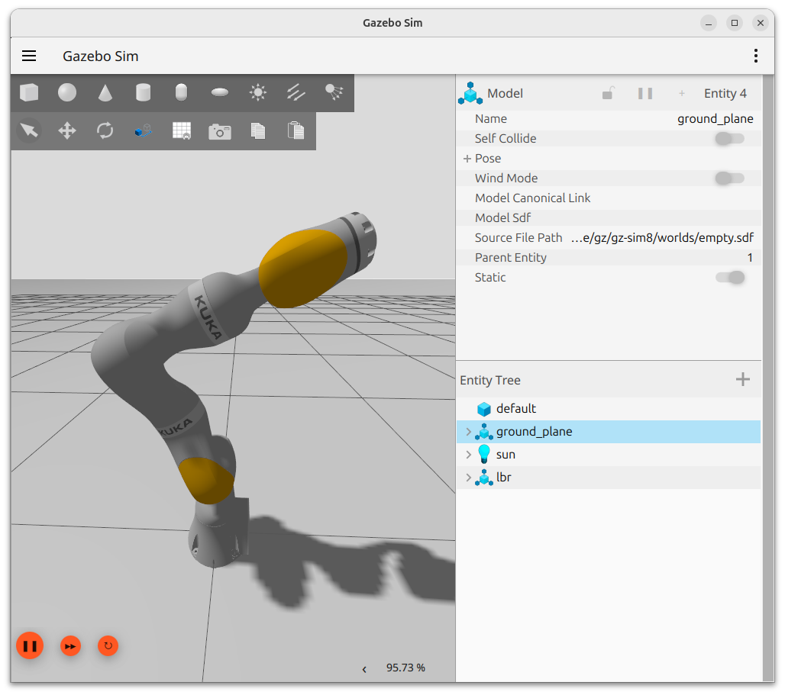
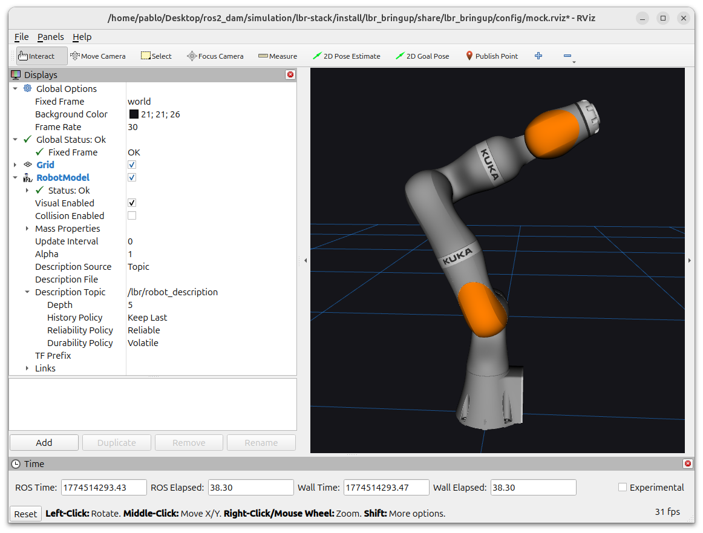
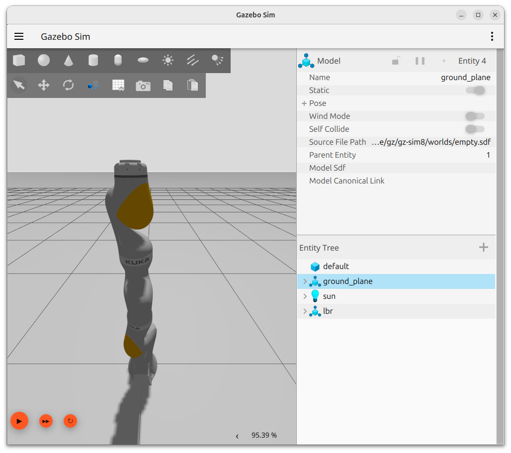
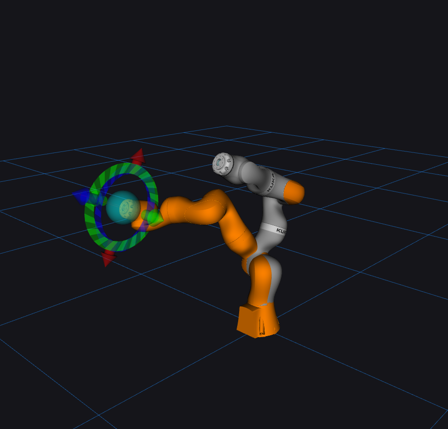

# 5. Workspace for iiwa 7 R800 on Gazebo

This chapter introduces the simulation workspace for the KUKA iiwa 7 R800 robot arm using Gazebo Harmonic, RViz2, and the lbr_fri_ros2_stack package. You will learn how to configure the environment, launch the robot in simulation and mock modes, visualize robot state in real time, and write Python scripts that send trajectory commands through ROS2 actions. Each section follows a step-by-step format consistent with previous chapters.

---

## 5.0.1 Example of custom ROS2 package, rqt and gazebo simulation

<figure>
  
  <figcaption>Figure 5.0.1 — Gazebo default world with the iiwa 7 R800 arm robot executing custom ROS2 package with efforts calculation for each joint on RQT</figcaption>
</figure>

## 5.1 Introduction to Gazebo Harmonic

**Gazebo Harmonic** is the current long-term support (LTS) release of the Gazebo robotics simulator. Unlike its predecessor Gazebo Classic, Gazebo Harmonic is built on the ignition framework and integrates natively with ROS2 through the `ros_gz` bridge packages. It provides physics simulation, sensor emulation, and a plugin system that allows external controllers — such as those provided by `ros2_control` — to actuate simulated joints.

For the iiwa 7 R800, Gazebo Harmonic simulates joint physics, applies effort limits, and exposes the robot's state through standard ROS2 topics and action servers, giving you an environment that closely mirrors the behavior of the real hardware.

### 5.1.1 How Does the Gazebo Harmonic Interface Work

When Gazebo Harmonic launches, it opens two main components:

- **3D Viewport** — renders the robot model, environment, and sensor data in real time.
- **Entity tree** — lists every model, link, and sensor present in the simulation world.

The interface is controlled through the menu bar at the top of the window and a toolbar on the left side. The most frequently used controls are:

| Control             | Location           | Function                                          |
| ------------------- | ------------------ | ------------------------------------------------- |
| Play / Pause        | Bottom bar         | Start or pause the physics simulation             |
| Step                | Bottom bar         | Advance the simulation by one time step           |
| Transform tools     | Left toolbar       | Translate, rotate, or scale models                |
| View angle          | Left toolbar       | Switch between perspective and orthographic views |
| Topic viewer plugin | Plugins menu       | Inspect live ROS2/Gazebo topic data               |
| Entity inspector    | Right-click entity | View and edit model properties                    |

<figure>
  
  <figcaption>Figure 5.1 — Gazebo Harmonic viewport showing the iiwa 7 R800 robot arm in the default world.</figcaption>
</figure>

> **Important:** On native Ubuntu 24.04, ensure your graphics drivers are up to date.

---

## 5.2 Introduction to RViz2 3D Visualizer

**RViz2** (ROS Visualization) is a 3D visualization tool that reads data published on ROS2 topics and renders it in an interactive scene. Unlike Gazebo, RViz2 does not simulate physics — it only visualizes what the robot reports. This makes it an essential tool for checking that joint states, TF frames, and sensor data are correct before or during physical experiments.

For the iiwa 7 R800, RViz2 is particularly useful for:

- Verifying that the robot model updates correctly when joint trajectories are executed.
- Inspecting coordinate frame transforms in the TF tree.
- Monitoring force/torque and end-effector pose data in real time.

### 5.2.1 How Does the RViz2 Interface Work

The RViz2 window is divided into four main areas:

| Area                  | Function                                                                                  |
| --------------------- | ----------------------------------------------------------------------------------------- |
| 3D Viewport (center)  | Main display area. Shows the robot model, TF frames, and any added displays.              |
| Displays panel (left) | List of active visualization plugins. Each plugin subscribes to a topic and renders data. |
| Views panel (right)   | Camera type and orientation presets (e.g., Orbit, TopDown, FPS).                          |
| Tool bar (top)        | Select, Measure, 2D Nav Goal, and other interaction tools.                                |

To add a new display, click the **Add** button at the bottom of the Displays panel and select a display type such as `RobotModel`, `TF`, or `JointState`.

<figure>
  
  <figcaption>Figure 5.2 — RViz2 displaying the iiwa 7 R800 with active TF frame visualization.</figcaption>
</figure>

> **Technical Note:** RViz2 configurations can be saved as `.rviz` files and reloaded at startup using the `--display-config` flag. The lbr_fri_ros2_stack package includes a pre-built configuration for the iiwa 7 R800.

---

## 5.3 Introduction to lbr_fri_ros2_stack

The **lbr_fri_ros2_stack** is an open-source ROS2 package that provides a complete integration layer between KUKA LBR robots (including the iiwa series) and ROS2. It bundles robot descriptions (URDF/xacro), `ros2_control` hardware interfaces, Gazebo simulation support, MoveIt2 configuration, and demo scripts into a single cohesive stack.

### 5.3.1 How Does lbr_fri_ros2_stack Work

The stack is structured around the **KUKA Fast Robot Interface (FRI)**. On real hardware, FRI is a UDP-based protocol for high-frequency control at rates up to 1 kHz. In simulation and mock modes, the FRI layer is replaced by either a Gazebo physics plugin or a software stub that mirrors the same ROS2 interface. This means the same ROS2 nodes and Python scripts work identically in all three contexts:

| Mode          | FRI Layer                             | Use Case                                                   |
| ------------- | ------------------------------------- | ---------------------------------------------------------- |
| Mock          | Software stub (no physics)            | Testing controllers and Python scripts without a simulator |
| Gazebo        | Gazebo physics plugin via `ros_gz`    | Full 3D simulation with physics and collision              |
| Real hardware | UDP FRI connection to KUKA controller | Deployment on the physical robot                           |

### 5.3.2 The Purpose of lbr_fri_ros2_stack

The stack serves three primary purposes in this workspace:

1. It provides the URDF robot description that RViz2 and Gazebo use to render the iiwa 7 R800 model.
2. It configures `ros2_control` with the `joint_trajectory_controller`, exposing the `FollowJointTrajectory` action server that the Python demos target.
3. It supplies ready-made launch files that start Gazebo, the ROS2 control manager, and RViz2 with correct parameters for the iiwa 7 R800 in a single command.

> **Technical Note:** The `FollowJointTrajectory` action server address used in the Python demos — `joint_trajectory_controller/follow_joint_trajectory` — is provided by `ros2_control` and configured by lbr_fri_ros2_stack. You do not need to create or manage this server manually.

---

## 5.4 Environment Setup for iiwa 7 R800

This section walks through a complete installation of all required packages and dependencies. Follow each step in the order presented.

### 5.4.1 Prerequisites

Before starting the installation, verify that your system meets the following requirements:

| Requirement | Version            | Verification Command |
| ----------- | ------------------ | -------------------- |
| Ubuntu      | 24.04 LTS          | `lsb_release -a`     |
| ROS2        | Jazzy Jalisco      | `ros2 --version`     |
| Python      | 3.10 or later      | `python3 --version`  |
| Git         | Any recent version | `git --version`      |
| colcon      | Any recent version | `colcon version`     |

### 5.4.2 Process Installation

**Step 1 — Install Gazebo Harmonic and ROS2 bridge packages:**

```bash
sudo apt update
sudo apt install -y ros-jazzy-ros-gz \
                    ros-jazzy-gz-ros2-control \
                    ros-jazzy-ros2-control \
                    ros-jazzy-ros2-controllers \
                    ros-jazzy-control-msgs
                    ros-dev-tools
```

**Step 2 — Create a ROS2 workspace and clone the lbr_fri_ros2_stack repository:**

```bash
source /opt/ros/jazzy/setup.bash
export FRI_CLIENT_VERSION=1.15

mkdir -p ~/ros2_ws/src
cd ~/ros2_ws/src
git clone https://github.com/lbr-stack/lbr_fri_ros2_stack.git -b jazzy src/lbr_fri_ros2_stack
vcs import src < src/lbr_fri_ros2_stack/lbr_fri_ros2_stack/repos-fri-${FRI_CLIENT_VERSION}.yaml
```

**Step 3 — Install all ROS2 dependencies declared in the package manifests:**

```bash
cd ~/ros2_ws
rosdep update
rosdep install --from-paths src -i -r -y
```

**Step 4 — Build the workspace with colcon:**

```bash
cd ~/ros2_ws
colcon build --symlink-install
```

**Step 5 — Source the workspace overlay:**

```bash
source ~/ros2_ws/install/setup.bash
```

> **Technical Note:** Add the source command to your `~/.bashrc` to avoid repeating it every session (if you don't know where your install/setup.bash is, do "pwd" command on where the install/setup.bash is located, then change the command below with the exact pwd output):
>
> ```bash
> echo 'source ~/ros2_ws/install/setup.bash' >> ~/.bashrc
> ```

**Step 6 — Verify the installation by listing available lbr packages:**

```bash
ros2 pkg list | grep lbr
```

**Expected Output:**

```bash
lbr_bringup
lbr_description
lbr_fri_idl
lbr_fri_ros2
lbr_ros2_control
lbr_demos
```

| If you see...                 | Action                                               |
| ----------------------------- | ---------------------------------------------------- |
| All packages listed above     | Proceed to Section 5.4.3                             |
| Empty output                  | Re-run `colcon build` and source the workspace again |
| Build errors during colcon    | Run `rosdep install` again, then rebuild             |
| `rosdep key not found` errors | Run `sudo rosdep init` followed by `rosdep update`   |

### 5.4.3 Mock and Visualization Setup

The lbr_fri_ros2_stack supports two launch configurations relevant to this chapter: **mock mode** and **Gazebo mode**. Mock mode is the fastest way to verify your Python scripts and RViz2 visualization without a full physics simulation.

**Launch in mock mode** (RViz2 only, no Gazebo):

```bash
ros2 launch lbr_bringup mock.launch.py \
    model:=iiwa7
```

**Launch RViz to visualize the setup**

```bash
ros2 launch lbr_bringup rviz.launch.py \
    rviz_cfg_pkg:=lbr_bringup \
    rviz_cfg:=config/mock.rviz
```

**Expected state after launch:**

| Component                     | Expected State                                                        |
| ----------------------------- | --------------------------------------------------------------------- |
| RViz2 window                  | Opens showing the iiwa 7 R800 model in the default configuration      |
| Gazebo window (sim mode only) | Opens showing the robot arm in the default world                      |
| `/lbr/joint_states` topic     | Publishing at ~100 Hz — verify with `ros2 topic hz /lbr/joint_states` |
| Action server                 | Available at `joint_trajectory_controller/follow_joint_trajectory`    |

<figure>
  
  <figcaption>Figure 5.2 — RViz2 window showing iiwa 7 R800 robot model with Gazebo simulation with ROS2 custom package</figcaption>
</figure>

> **Important:** Do not close the terminal running the launch file. It manages all child processes. Press `Ctrl + C` in that terminal to stop the entire simulation cleanly.

---

## 5.5 Automatic Scripts for Simulation Workspace Setup

To simplify the launch procedure, the repository includes shell scripts that start all components with a single command.

### 5.5.1 Available Scripts

| Script              | Mode              | Launches                                             |
| ------------------- | ----------------- | ---------------------------------------------------- |
| `run_simulation.sh` | Gazebo simulation | Gazebo Harmonic, ros2_control                        |
| `run_mockup.sh`     | Mock (no physics) | ros2_control stub                                    |
| `cleanup.sh`        | —                 | Sends SIGINT to all launched processes and cleans up |

### 5.5.2 Execution — Gazebo Mode

```bash
# Navigate to the scripts directory
cd scripts/

# Grant execution permissions (only required once)
chmod +x run_simulation.sh

# Launch the full Gazebo simulation
./run_simulation.sh
```

### 5.5.3 Execution — Mock Mode

```bash
chmod +x run_mockup.sh
./run_mockup.sh
```

### 5.5.4 What the Scripts Do

| Step | Action                                                                           |
| ---- | -------------------------------------------------------------------------------- |
| 1    | Sources the ROS2 Jazzy setup file and the local workspace overlay                |
| 2    | Verifies that the lbr_fri_ros2_stack packages are installed                      |
| 3    | Launches the `lbr_bringup` launch file with the correct model and sim parameters |
| 4    | Handles graceful cleanup when stopped with `Ctrl + C`                            |

### 5.5.5 Stopping the Simulation

Press `Ctrl + C` in the terminal running the script, or execute the cleanup script for processes on background.

```bash
./cleanup.sh
```

> **Technical Note:** The stop script sends a clean shutdown signal to all spawned processes, preventing orphaned Gazebo or RViz2 instances that could conflict with the next launch.

---

## 5.6 Python Demos for Gazebo Simulator

The repository includes Python demo scripts that communicate with the simulated robot through the ROS2 action interface. These scripts work identically in both mock mode and Gazebo simulation mode because both expose the same action server.

Before running any demo, ensure that either the Gazebo or mock launch is active in a separate terminal. The demo scripts will block at startup until the action server is available.

### 5.6.1 Running the Joint Trajectory Demo

Open a new terminal, source the workspace, and run:

```bash
ros2 launch lbr_bringup gazebo.launch.py \
    ctrl:=joint_trajectory_controller \
    model:=iiwa7 # [iiwa7, iiwa14, med7, med14]

ros2 run lbr_demos_py joint_trajectory_client --ros-args -r __ns:=/lbr
```

**Expected terminal output:**

```
[INFO] [joint_trajectory_client]: Waiting for action server to become available...
[INFO] [joint_trajectory_client]: Action server available.
[INFO] [joint_trajectory_client]: Rotating odd joints.
[INFO] [joint_trajectory_client]: Goal was accepted by server.
[INFO] [joint_trajectory_client]: Moving to zero position.
[INFO] [joint_trajectory_client]: Goal was accepted by server.
```

**Expected robot behavior:**

| Phase             | Joint Positions (A1–A7)                                    | Duration   |
| ----------------- | ---------------------------------------------------------- | ---------- |
| Rotate odd joints | A1=1.0, A2=0.0, A3=1.0, A4=0.0, A5=1.0, A6=0.0, A7=1.0 rad | 15 seconds |
| Return to zero    | All joints at 0.0 rad                                      | 15 seconds |

<figure>
  
  <figcaption>Figure 5.3 — iiwa 7 R800 in the odd-joint configuration (left) and the home zero configuration (right).</figcaption>
</figure>

---

## 5.7 How to Create Your Own ROS2 Package for KUKA iiwa 7 R800

This section guides you through creating a minimal ROS2 Python package that can send trajectory commands to the iiwa 7 R800 using the same pattern as the `joint_trajectory.py` demo.

### 5.7.1 Create the Package

```bash
cd ~/ros2_ws/src
ros2 pkg create --build-type ament_python my_iiwa_pkg
```

Register the entry point in `setup.py`:

```python
    entry_points={
        'console_scripts': [
            "movimiento_robot = baile_sencillo.movimiento_robot:main",
        ],
    },
```

### 5.7.3 Build and Source

```bash
cd ~/ros2_ws
colcon build --packages-select my_iiwa_pkg --symlink-install
source install/setup.bash

# execution of the package
ros2 run my_iiwa_pkg --ros-args -r __ns:=/lbr
```

### 5.7.4 Understanding the joint_trajectory.py Demo

The demo script implements a ROS2 action client for the `FollowJointTrajectory` action. Below is a complete breakdown of each component.

#### Class: JointTrajectoryClient

Inherits from `Node` and creates an `ActionClient` connected to the `joint_trajectory_controller/follow_joint_trajectory` action server. The constructor blocks in a loop until the server is confirmed available, logging a waiting message every second.

```python
self._joint_trajectory_action_client = ActionClient(
    node=self,
    action_type=FollowJointTrajectory,
    action_name="joint_trajectory_controller/follow_joint_trajectory",
)
while not self._joint_trajectory_action_client.wait_for_server(1):
    self.get_logger().info("Waiting for action server to become available...")
```

| Method     | Parameters                                    | Description                                                                                                  |
| ---------- | --------------------------------------------- | ------------------------------------------------------------------------------------------------------------ |
| `__init__` | `node_name: str`                              | Initializes the ROS2 node and action client. Blocks until the action server is available.                    |
| `execute`  | `positions: list`, `sec_from_start: int = 15` | Builds and sends a `FollowJointTrajectory` goal. Blocks until the result is received or the timeout expires. |

#### Method: execute()

The `execute` method performs the following steps:

1. Validates that exactly 7 joint positions were provided (one per iiwa joint A1–A7).
2. Constructs a `JointTrajectoryPoint` with the target positions and zero velocities.
3. Sets the goal time tolerance to 1 second and the trajectory duration to `sec_from_start` seconds.
4. Sends the goal asynchronously and waits for acceptance using `rclpy.spin_until_future_complete`.
5. If accepted, waits for the result with a timeout of `sec_from_start + 1` seconds.
6. Checks the `error_code` on the result; logs an error if the trajectory was not executed successfully.

```python
point = JointTrajectoryPoint()
point.positions = positions
point.velocities = [0.0] * len(positions)
point.time_from_start.sec = sec_from_start

for i in range(7):
    joint_trajectory_goal.trajectory.joint_names.append(f"lbr_A{i + 1}")
joint_trajectory_goal.trajectory.points.append(point)
```

#### Function: main()

The `main` function initializes rclpy, creates a `JointTrajectoryClient` node, and calls `execute` twice in sequence:

| Call                      | Target Positions (A1–A7)              | Effect                                                         |
| ------------------------- | ------------------------------------- | -------------------------------------------------------------- |
| First — rotate odd joints | `[1.0, 0.0, 1.0, 0.0, 1.0, 0.0, 1.0]` | Odd-numbered joints rotate to 1 radian; even joints stay at 0. |
| Second — return to zero   | `[0.0, 0.0, 0.0, 0.0, 0.0, 0.0, 0.0]` | All joints return to the home configuration.                   |

> **Technical Note:** The `sec_from_start` parameter controls how many seconds the controller is given to reach the target configuration. Increase this value for larger angular movements or when operating with lower velocity limits.

#### Key ROS2 Concepts Demonstrated

| Concept                      | Where Used                   | Purpose                                                                      |
| ---------------------------- | ---------------------------- | ---------------------------------------------------------------------------- |
| Action client                | `ActionClient` in `__init__` | Asynchronous goal-based communication for long-running tasks                 |
| `spin_until_future_complete` | `execute` method             | Blocks the node until an async operation finishes                            |
| `JointTrajectoryPoint`       | `execute` method             | Specifies target positions and velocities for all joints at a given time     |
| `FollowJointTrajectory`      | Goal and Result types        | Standard action interface for joint trajectory controllers in `ros2_control` |

---

## 5.8 MoveIt Control on RViz and Gazebo

**MoveIt2** is the standard motion planning framework for ROS2. Integrated with the lbr_fri_ros2_stack, it allows you to control the iiwa 7 R800 interactively through RViz2 using a drag-and-drop end-effector marker, while the computed trajectory is executed on the physics engine in Gazebo Harmonic. This combination gives you collision-aware motion planning without writing a single line of code.

<figure>

<figcaption>Figure 5.8.1 — iiwa 7 R800 with MoveIt configuration for /joint_trajectory</figcaption>
</figure>

### 5.8.1 MoveIt via RViz — Simulation

**Step 1 — Run the mock setup:**

```bash
ros2 launch lbr_bringup mock.launch.py \
    model:=iiwa7 # [iiwa7, iiwa14, med7, med14]
```

> **Technical Note:** For a physics-based simulation, also try Gazebo (remember to set `mode:=gazebo` for the next steps):
>
> ```bash
> ros2 launch lbr_bringup gazebo.launch.py \
>     model:=iiwa7 # [iiwa7, iiwa14, med7, med14]
> ```

**Step 2 — Run MoveIt with RViz:**

```bash
ros2 launch lbr_bringup move_group.launch.py \
    mode:=mock \
    rviz:=true \
    model:=iiwa7 # [iiwa7, iiwa14, med7, med14]
```

**Step 3 — You can now move the robot via MoveIt in RViz!**

Use the interactive end-effector marker in RViz2 to set a goal pose, then use the **MotionPlanning** panel to plan and execute the trajectory:

| MotionPlanning Panel Button | Function                                                                         |
| --------------------------- | -------------------------------------------------------------------------------- |
| Plan                        | Computes a collision-free trajectory to the marker goal; does not move the robot |
| Execute                     | Sends the last planned trajectory to the controller                              |
| Plan & Execute              | Combines both steps in a single click                                            |
| Stop                        | Halts execution immediately                                                      |

### 5.8.2 Example on RViz2 + Gazebo and MoveIt

<figure>

<figcaption>Figure 5.8.2 — iiwa 7 R800 being controlled with the mouse on RViz2 through MoveIt2, with physics execution in Gazebo Harmonic.</figcaption>
</figure>

### 5.8.3 Automatic Script

To launch the complete MoveIt + RViz setup with a single command, use the provided script:

```bash
# Grant execution permissions (only required once)
chmod +x run_moveit_rviz.sh

# Launch MoveIt with RViz
./run_moveit_rviz.sh
```

> **Technical Note:** The `run_moveit_rviz.sh` script sources the workspace, starts the mock or Gazebo simulation, and launches `move_group.launch.py` with the correct parameters for the iiwa 7 R800 automatically.

> **Technical Note:** To close correctly the ./run_moveit_rviz.sh script, must do `Ctrl + C` on the command window that executed the script for proper clossing ritual of the tool.

## 5.9 Concerns and Simulation Limitations

While Gazebo Harmonic and the lbr_fri_ros2_stack provide a high-fidelity simulation environment, there are several known limitations and considerations to keep in mind when working with the iiwa 7 R800 simulation.

| Limitation                           | Description                                                                                                                                                                                          |
| ------------------------------------ | ---------------------------------------------------------------------------------------------------------------------------------------------------------------------------------------------------- |
| **Physics fidelity gap**             | Gazebo physics parameters (inertia, friction, damping) are approximations. Torques and joint behavior may differ from the real robot, especially under load.                                         |
| **FRI latency not simulated**        | In real deployment, FRI communication introduces network latency. The simulation runs at wall-clock speed with no network delay, so timing-sensitive controllers may behave differently on hardware. |
| **No tool/end-effector model**       | The default simulation does not include a gripper or tool. Adding one requires modifying the URDF and rebuilding the workspace.                                                                      |
| **Single-point trajectories**        | The `joint_trajectory.py` demo sends one trajectory point per call. Multi-point smooth trajectories require building a list of `JointTrajectoryPoint` objects with intermediate waypoints.           |
| **Velocity and acceleration limits** | The simulation enforces the joint limits defined in the URDF. Requesting movements that violate these limits will cause the goal to be rejected or result in incomplete motion.                      |
| **Mock mode has no collision**       | Mock mode does not run a physics engine. Self-collisions and environment collisions are not detected. Always validate configurations in Gazebo before deploying to hardware.                         |
| **RViz2 display lag**                | On systems with limited GPU resources, RViz2 may lag behind the actual joint state. This is a visualization issue only and does not affect the controller.                                           |

Best practices to mitigate these limitations:

- Always test new trajectory scripts in mock mode first, then in Gazebo, before any hardware deployment.
- Use `rqt_plot` or `ros2 topic echo /lbr/joint_states` to verify that joint positions match your expected targets after each trajectory.
- Keep `sec_from_start` values conservative (15 seconds or more for full-range movements) to avoid timeout errors.

> **Important:** The simulation environment is intended for development and learning purposes only. Never use simulation results as the sole basis for deploying motion to a physical KUKA iiwa robot without following KUKA safety protocols and performing supervised hardware testing.
